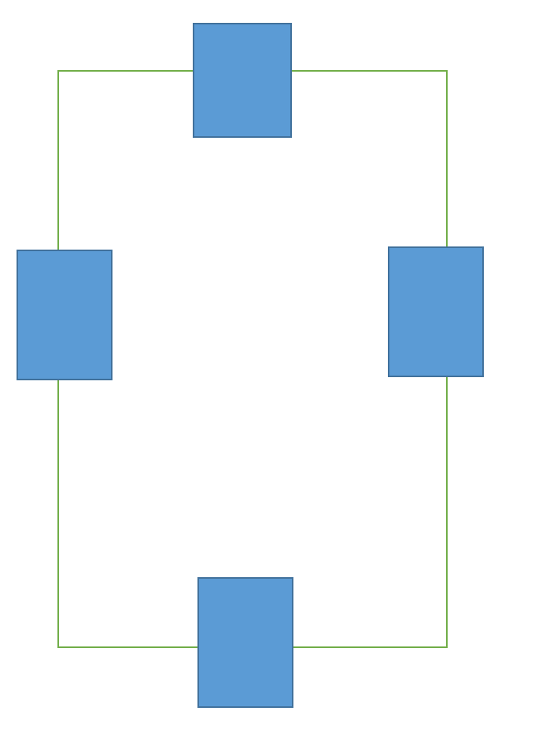

# 检测dom是否在视图内

## 提供函数列表
| 函数名        | 说明    |  参数  | 返回值|
| --------     | :-----   | :----|:----|
| isInDomView   | 检测dom在容器dom内是否可见      |   参考isInDomView说明   | boolean|
| isInView        | 检测dom在窗口内是否完全可见    |   检测的dom   | boolean|

## 其他辅助函数
| 函数名        | 说明    |  参数  |返回值|
| --------     | :-----   | :---- |:----|
| getBoundingClientRect   |   获取dom的rect对象    | 对象  { dom, rotate }   | rect 对象|
| getRectHeight        |   获取dom的rect对象的高度  |  对象 { dom, rotate }    | number|
| getRectWidth        |   获取dom的rect对象的宽度  |  对象  { dom, rotate }   |number|
| getViewPortHeight        | 获取视图高度    |   -   |number|
| getViewPortWidth        |   获取视图宽度  |    -  |number|
| getBodyScrollY        |   获取body Y轴滚动  |   -   |number|
| getBodyScrollY        |   获取body Y轴滚动  |   -   |number|
| getDomScrollX        |   获取 dom X轴滚动  |    dom  |number|
| getDomScrollY        |  获取dom Y轴滚动   |   dom   |number|

## 示意图

### 图1

### 图2

## api 说明
### isInDomView
#### 说明
兼容dom在父容器里面是否可见
#### 参数
对象类型
**dom**: 兼容测dom
**wrapDom**: 检测dom的父容器
**overallVisible**: 是否部分在父容器可见，默认否，如果设置了true，那一部分可见isInDomView函数也会返回true，如【图2】,否则只有如图一时候才会true

